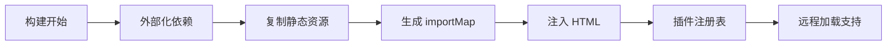

# Vue 插件架构系统

一个基于 Vue 3 + TypeScript + Vite 的现代化插件架构系统，为构建可扩展的前端应用提供插件化生态解决方案。

> **注意**
> 目前架构中的一些设计与我的业务强相关，例如 dockview。如果要使用这个架构，建议根据需要修改源码。

## ✨ 核心特性

- **🔌 动态插件系统**: 支持运行时通过URL动态加载/卸载插件
- **🎛️ 可视化面板**: 基于 Dockview 的拖拽式面板布局系统（由宿主应用提供）
- **🔄 事件通信**: 基于 mitt 的轻量级事件总线
- **🛡️ 类型安全**: 完整的 TypeScript 类型系统
- **⚡ ImportMap机制**: 统一开发和生产环境的模块解析，支持远程插件加载

## 📁 项目架构

```
vue-plugin-architecture/
├── docs/                           # 项目文档
├── packages/                       # 核心包目录
│   ├── types/                      # 📁 共享类型定义包
│   │
│   ├── core/                       # 📁 核心运行时包
│   │   └── src/
│   │       ├── plugin/             # 插件管理器
│   │       ├── layout/             # 布局管理器
│   │       ├── event/              # 事件总线
│   │       ├── data/               # 数据服务
│   │       ├── proxy/              # 服务代理
│   │       └── error/              # 错误处理
│   │
│   ├── vite-plugin/                # 📁 Vite 构建插件
│   │   └── src/
│   │       ├── index.ts            # 插件主入口
│   │       └── scanner.ts          # 插件扫描器
│   │
│   ├── demo/                       # 📁 示例应用
│   │   └── src/
│   │       ├── main.ts             # 应用入口
│   │       ├── App.vue             # 主应用组件
│   │       └── views/              # 页面视图
│   │
│   └── plugins/                    # 📁 插件包目录
│       └── plugin-helloworld/      # Hello World 示例插件
│
├── pnpm-workspace.yaml             # pnpm 工作空间配置
└── package.json                    # 根目录包配置
```

### 结构说明

| 包名                                 | 描述          | 主要功能                                  |
| ------------------------------------ | ------------- | ----------------------------------------- |
| `@vue-plugin-arch/types`             | 类型定义包    | 共享 TypeScript 类型定义                  |
| `@vue-plugin-arch/core`              | 核心运行时包  | 插件管理、布局管理、事件通信、数据服务    |
| `@vue-plugin-arch/vite-plugin`       | Vite 构建插件 | 插件注册表服务、importMap注入、热更新支持 |
| `@vue-plugin-arch/demo`              | 示例应用      | 完整的插件系统集成示例                    |
| `@vue-plugin-arch/plugin-helloworld` | 示例插件      | 展示插件开发的基础功能和最佳实践          |

## 🚀 快速开始

### 环境要求

- **Node.js**: >= 18.0.0
- **包管理器**: pnpm >= 10.0.0

### 主要命令

```bash
# 开发
pnpm dev                    # 启动 demo 应用开发服务器
pnpm type-check            # 全项目类型检查
pnpm lint                  # 代码检查
pnpm format                # 代码格式化

# 构建
pnpm build                 # 构建所有核心包
pnpm build:demo            # 构建 demo 应用
pnpm build:all             # 构建所有包 (包括 demo)

# 其他
pnpm preview               # 预览构建后的 demo 应用
pnpm clean                 # 清理所有构建产物
```

### 示例应用功能

Demo 应用展示了插件系统的核心功能：

- 🏠 **插件系统概览**: 查看已加载的插件和系统状态
- 🔧 **动态插件管理**: 运行时加载/卸载插件
- 📋 **可视化面板布局**: 基于 Dockview 的拖拽式面板系统
- 🔄 **事件通信演示**: 插件间和插件与主应用的事件交互

## 📖 使用指南

### 在现有项目中集成

#### 1. 安装依赖

```bash
# 核心依赖
pnpm add @vue-plugin-arch/types @vue-plugin-arch/core @vue-plugin-arch/vite-plugin

# 必需的第三方依赖
pnpm add dockview-vue mitt vue
```

#### 2. 配置 Vite 插件

```typescript
// vite.config.ts
import { defineConfig } from 'vite'
import vue from '@vitejs/plugin-vue'
import {
  vuePluginArch,
  VuePluginArchOptions,
} from '@vue-plugin-arch/vite-plugin'

const createVuePluginArchConfig = (isDev: boolean): VuePluginArchOptions => {
  const options: VuePluginArchOptions = {
    workspace: {
      root: path.resolve(__dirname, '../..'),
      pluginsDir: 'packages/plugins',
    },
    registry: {
      endpoint: '/api/plugin-registry.json',
      staticPath: 'public/api/plugin-registry.json',
    },
    build: {
      copyPluginDist: !isDev,
      enableImportMap: !isDev,
      importMapPlaceholder: '<!-- Import map will be injected here -->', // index.html 中预留的用于替换的字符串
    },
  }

  // 仅在构建模式下配置外部依赖和 importMap
  if (!isDev) {
    options.external = {
      deps: ['vue', 'vue-i18n'],
      staticTargets: [
        {
          src: 'node_modules/vue/dist/vue.esm-browser.prod.js',
          dest: 'libs',
          rename: 'vue.js',
        },
        {
          src: 'node_modules/vue-i18n/dist/vue-i18n.esm-browser.prod.js',
          dest: 'libs',
          rename: 'vue-i18n.js',
        },
      ],
      paths: {
        vue: '/libs/vue.js',
        'vue-i18n': '/libs/vue-i18n.js',
      },
    }
  }

  return options
}

export default defineConfig(({ command }) => ({
  plugins: [
    vue(),
    ...vuePluginArch(createVuePluginArchConfig(command === 'serve')),
  ],
}))
```

#### 3. 初始化插件系统 (main.ts)

在你的应用入口文件 (例如 `main.ts`) 中，创建并提供插件管理器。

```typescript
// src/main.ts
import 'dockview-vue/dist/styles/dockview.css' // 引入 Dockview 样式

import { createApp } from 'vue'
import App from './App.vue'
import { createPluginManager } from '@vue-plugin-arch/core'
import type { IPluginStorage } from '@vue-plugin-arch/types'

// 创建一个插件存储实现 (示例：基于内存的存储)
class MemoryPluginStorage implements IPluginStorage {
  private data = new Map<string, Map<string, unknown>>()

  async get(name: string, key: string): Promise<unknown> {
    const pluginData = this.data.get(name)
    return pluginData?.get(key)
  }

  async set(name: string, key: string, value: unknown): Promise<void> {
    if (!this.data.has(name)) {
      this.data.set(name, new Map<string, unknown>())
    }
    this.data.get(name)!.set(key, value)
  }

  async getAll(name: string): Promise<Record<string, unknown>> {
    const pluginData = this.data.get(name)
    if (!pluginData) {
      return {}
    }
    return Object.fromEntries(pluginData.entries())
  }

  async remove(name: string, key: string): Promise<void> {
    const pluginData = this.data.get(name)
    if (pluginData) {
      pluginData.delete(key)
    }
  }

  async removeAll(name: string): Promise<void> {
    this.data.delete(name)
  }

  async clear(): Promise<void> {
    this.data.clear()
  }
}

const app = createApp(App)

// 创建插件管理器
const pluginManager = createPluginManager(app, new MemoryPluginStorage())

// 将插件管理器提供给整个应用
app.provide('pluginManager', pluginManager)
app.mount('#app')
```

#### 4. 在组件中使用插件布局

在你的根组件 (例如 `App.vue`) 中，集成 `dockview-vue` 并将其与插件系统的布局管理器连接。

```vue
<!-- src/App.vue -->
<template>
  <main class="app-main">
    <!-- Dockview 容器 -->
    <dockview-vue
      class="dockview-container"
      :theme="themeLight"
      @ready="onDockviewReady"
    />
  </main>
</template>

<script setup lang="ts">
import { inject } from 'vue'
import { DockviewVue, type DockviewReadyEvent, themeLight } from 'dockview-vue'
import type { IPluginManager } from '@vue-plugin-arch/types'

// 注入插件管理器
const pluginManager = inject<IPluginManager>('pluginManager')

// Dockview 就绪回调
const onDockviewReady = (event: DockviewReadyEvent) => {
  if (pluginManager) {
    // 将 Dockview API 设置到布局管理器
    pluginManager.layoutManager.setDockviewApi(event.api)
  }

  // 你可以在这里添加默认面板
  event.api.addPanel({
    id: 'default-panel',
    component: 'div', // 可以是任意已注册的组件名
    title: 'Welcome',
  })
}
</script>

<style>
.app-main,
.dockview-container {
  height: 100vh;
  width: 100%;
}
</style>
```

## 🔧 ImportMap 机制详解

### 工作原理

ImportMap 机制是本系统实现统一插件加载的核心技术，它解决了开发和生产环境下模块解析不一致的问题。

#### 开发模式流程

```mermaid
graph LR
    A[插件请求] --> B[Vite 开发服务器]
    B --> C[/@fs/ URL 解析]
    C --> D[本地文件系统]
    D --> E[TypeScript/Vue 源码]
    E --> F[实时编译]
    F --> G[热重载支持]
```

1. **插件扫描**: Vite 插件自动扫描 `packages/plugins/` 目录
2. **URL 生成**: 为每个插件生成 `/@fs/` 格式的开发 URL
3. **注册表服务**: 提供 `/api/plugin-registry.json` 端点
4. **热重载**: 支持插件源码的实时更新

#### 构建模式流程



1. **依赖外部化**: 将 Vue 等共享依赖标记为 external
2. **静态资源复制**: 复制外部依赖到 `/libs/` 目录
3. **ImportMap 注入**: 在 HTML 中注入模块路径映射
4. **插件构建**: 复制插件构建产物到 `/plugins/` 目录
5. **注册表生成**: 生成静态插件注册表文件

### 配置示例

#### HTML 模板配置

```html
<!DOCTYPE html>
<html>
  <head>
    <meta charset="UTF-8" />
    <title>Vue Plugin Architecture</title>
    <!-- ImportMap 占位符 - 构建时会被替换 -->
    <!-- Import map will be injected here -->
  </head>
  <body>
    <div id="app"></div>
    <script type="module" src="/src/main.ts"></script>
  </body>
</html>
```

#### 构建后的 ImportMap

```html
<script type="importmap">
  {
    "imports": {
      "vue": "/libs/vue.js",
      "vue-i18n": "/libs/vue-i18n.js",
      "vue-router": "/libs/vue-router.js"
    }
  }
</script>
```

### 插件 URL 格式

#### 开发模式

```javascript
// 本地插件 URL 示例
'/@fs/C:/project/packages/plugins/plugin-helloworld/src/index.ts'
```

#### 构建模式

```javascript
// 本地插件
'/plugins/plugin-helloworld/index.js'

// 远程插件
'https://cdn.example.com/plugins/plugin-advanced/v1.2.0/index.js'
```

### 最佳实践

#### 1. 版本管理

```javascript
// 推荐：包含版本号的远程插件 URL
'https://cdn.example.com/plugins/plugin-name/v1.2.0/index.js'

// 避免：无版本号的 URL（缓存问题）
'https://cdn.example.com/plugins/plugin-name/latest/index.js'
```

#### 2. 错误处理

```javascript
// 插件加载错误处理
try {
  const plugin = await import(pluginUrl)
  await pluginManager.installPlugin(plugin)
} catch (error) {
  console.error(`Failed to load plugin: ${pluginUrl}`, error)
  // 提供降级方案或用户提示
}
```

#### 3. 性能优化

```javascript
// 预加载关键插件
const criticalPlugins = [
  '/plugins/plugin-core/index.js',
  '/plugins/plugin-ui/index.js',
]

// 使用 Promise.all 并行加载
await Promise.all(criticalPlugins.map(url => import(url)))
```

### 插件开发

#### 1. 创建插件包

> 插件可以存在于项目 `packages/plugins` 目录中，也可以是独立的仓库，通过 npm/pnpm 安装后即可被识别。

以下是在本仓库中创建插件的示例：

```bash
# 在 packages/plugins/ 目录下创建新插件
mkdir packages/plugins/plugin-my-feature
cd packages/plugins/plugin-my-feature
```

#### 2. 配置插件清单 (package.json)

```json
{
  "name": "@vue-plugin-arch/plugin-my-feature",
  "version": "0.1.0",
  "description": "My awesome feature plugin",
  "type": "module",
  "main": "./dist/index.js",
  "types": "./dist/index.d.ts",
  "icon": "🚀",
  "components": [
    {
      "name": "MyFeaturePanel",
      "path": "./components/MyFeaturePanel.vue",
      "title": "My Feature",
      "defaultPosition": "center"
    }
  ],
  "devDependencies": {
    "@vue-plugin-arch/types": "workspace:*"
  }
}
```

#### 3. 实现插件入口

```typescript
// src/index.ts
import type { IPluginServiceProxy, PluginAPI } from '@vue-plugin-arch/types'
import MyFeaturePanel from './components/MyFeaturePanel.vue'

export const install = (proxy: IPluginServiceProxy): PluginAPI => {
  // 注册面板
  const panelId = proxy.registerPanel({
    id: 'my-feature-panel',
    component: MyFeaturePanel,
    title: 'My Feature',
    position: 'center',
  })

  // 获取插件专属数据 API
  const dataAPI = proxy.getDataAPI()

  return {
    teardown: async () => {
      proxy.removePanel(panelId)
      await dataAPI.removeAll()
    },
  }
}
```

#### 4. 创建插件组件

```vue
<!-- src/components/MyFeaturePanel.vue -->
<template>
  <div class="my-feature-panel">
    <h3>{{ title }}</h3>
    <button @click="doSomething">执行功能</button>
    <p v-if="result">结果: {{ result }}</p>
  </div>
</template>

<script setup lang="ts">
import { ref } from 'vue'
import type { IPluginServiceProxy } from '@vue-plugin-arch/types'

const props = defineProps<{
  title?: string
  // 核心：插件服务代理通过 props 注入
  proxy: IPluginServiceProxy
}>()

const result = ref('')

const doSomething = async () => {
  result.value = 'Feature executed!'

  // 通过 props.proxy 调用核心 API
  props.proxy.eventBus.emit('my-feature:executed', {
    timestamp: Date.now(),
  })
}
</script>
```

## 🌐 兼容性说明

### ImportMap 机制兼容性

本系统的核心特性 ImportMap 机制在不同环境下的兼容性：

#### 浏览器支持

| 浏览器  | 版本要求 | ImportMap 支持 | Dynamic Import | 备注          |
| ------- | -------- | -------------- | -------------- | ------------- |
| Chrome  | 89+      | ✅ 原生支持    | ✅ 63+         | 推荐使用      |
| Firefox | 108+     | ✅ 原生支持    | ✅ 67+         | 完全兼容      |
| Safari  | 16.4+    | ✅ 原生支持    | ✅ 11.1+       | 需要较新版本  |
| Edge    | 89+      | ✅ 原生支持    | ✅ 79+         | 基于 Chromium |

详情请查看 [Can I use ImportMap?](https://caniuse.com/?search=ImportMap)

#### 降级策略

对于不支持 ImportMap 的旧版浏览器，可以使用 polyfill：

```html
<!-- 在 index.html 中添加 -->
<script
  async
  src="https://ga.jspm.io/npm:es-module-shims@1.8.0/dist/es-module-shims.js"
></script>
```

#### 开发环境要求

- **Node.js**: >= 18.0.0 (推荐 >= 20.0.0)
- **pnpm**: >= 10.0.0
- **现代浏览器**: 支持 ES2020+ 语法

### 插件加载模式

#### 开发模式 (Development)

- 使用 `/@fs/` URL 直接访问本地文件系统
- 支持 TypeScript 和 Vue 文件的热重载
- 无需 importMap，直接通过 Vite 开发服务器解析

#### 构建模式 (Production)

- 注入 importMap 配置到 HTML
- 外部依赖复制到 `/libs/` 目录
- 支持远程插件通过 CDN 或外部服务器加载

### 部署兼容性

#### 静态部署

- 支持 Nginx、Apache 等静态文件服务器
- 需要配置正确的 MIME 类型：`application/javascript` for `.js` files
- 建议启用 gzip 压缩以优化加载性能

#### CDN 部署

- 支持将插件部署到 CDN
- 需要配置 CORS 头以允许跨域加载
- 建议使用版本化 URL 进行缓存管理

#### 容器化部署

- 支持 Docker 容器化部署
- 兼容 Kubernetes 等容器编排平台
- 支持多实例负载均衡

## 📦 构建

```bash
# 构建所有核心包 (按依赖顺序)
pnpm build

# 构建特定包 (等价于 pnpm build)
pnpm build:types          # 构建类型定义包
pnpm build:core           # 构建核心运行时包
pnpm build:vite-plugin    # 构建 Vite 插件包
pnpm build:plugins        # 构建所有插件包

# 构建示例应用
pnpm build:demo           # 构建 demo 应用
pnpm build:all            # 构建所有包 (包括 demo)

# 清理构建产物
pnpm clean
```

## 📄 许可证

本项目采用 MIT 许可证 - 查看 [LICENSE](LICENSE) 文件了解详情。

## 🔗 相关链接

### 技术文档

- [Vue 3 文档](https://vuejs.org/) - 前端框架
- [Vite 文档](https://vitejs.dev/) - 构建工具
- [TypeScript 文档](https://www.typescriptlang.org/) - 类型系统
- [pnpm 文档](https://pnpm.io/) - 包管理器
- [Dockview 文档](https://dockview.dev/) - 面板布局系统
- [mitt 文档](https://github.com/developit/mitt) - 事件总线

### 项目文档

#### 核心架构

- [📋 架构总览](docs/architecture-overview.md) - 系统整体架构设计、核心模块组成和工作流程详解
- [🔌 插件系统](docs/plugin-system.md) - 插件生命周期管理、状态机制和加载流程
- [🎛️ 布局管理](docs/layout-management.md) - 动态面板系统、组件注册机制和渲染流程

#### 开发指南

- [🚀 插件开发指南](docs/plugin-development-guide.md) - 从零开始创建插件的完整教程和最佳实践
- [📚 插件API参考](docs/plugin-api-reference.md) - 插件服务代理接口的详细API文档
- [⚡ Vite插件用法](docs/vite-plugin-usage.md) - 构建工具配置、ImportMap机制和部署策略

#### 核心服务

- [🔄 事件总线](docs/event-bus.md) - 插件间通信机制、作用域管理和事件API
- [💾 插件数据服务](docs/plugin-data-service.md) - 数据持久化、作用域隔离和存储适配器

---

<div align="center">

**Vue 插件架构系统** - 让你的 Vue 应用具备扩展能力

Made with ❤️ by hllshiro

</div>
