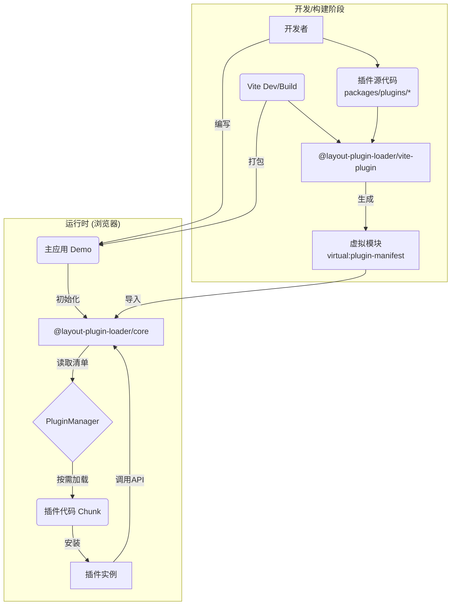

# 架构总览

本系统是一个基于插件化的前端微核（Micro-core）架构，旨在提供一个可扩展的动态布局和功能组合平台。其核心思想是将应用的核心能力（如布局管理、事件通信、数据服务）与业务功能（作为“插件”实现）完全解耦。

## 设计目标

- **高度可扩展性**: 任何业务功能都可以作为独立的插件进行开发、部署和加载。
- **关注点分离**: 核心框架专注于提供稳定、通用的服务，而插件则专注于实现具体的业务逻辑。
- **动态化**: 支持在运行时动态加载、卸载和更新插件，无需重新编译主应用。
- **开发效率**: 插件可以独立开发和测试，简化了团队协作和维护流程。

## 核心模块

项目采用Monorepo结构，主要由以下几个核心模块（Package）组成：

### 1. `@layout-plugin-loader/core`

核心运行时库，是整个架构的心脏。它不关心任何具体的业务逻辑，只提供一套完整的插件生命周期管理和基础服务，包括：

- **插件管理器 (`PluginManager`)**: 负责插件的加载、初始化、激活和卸载。
- **布局管理器 (`LayoutManager`)**: 提供动态渲染能力，允许插件将自己的Vue组件注册到应用的指定位置（如侧边栏、主内容区等）。
- **事件总线 (`EventBus`)**: 提供一个发布/订阅模式的通信机制，用于在插件之间或插件与主应用之间传递消息，实现模块解耦。
- **数据服务 (`PluginDataService`)**: 提供一个统一的键值存储API，允许插件持久化或共享状态，同时通过命名空间进行隔离。
- **API代理 (`PluginServiceProxy`)**: 一个安全代理，将核心服务（布局、事件、数据）以受控的方式暴露给每个插件，避免插件直接访问核心实例。

### 2. `@layout-plugin-loader/vite-plugin`

一个为本架构定制的Vite构建插件。它的主要职责是在**构建时**而非运行时工作：

- **插件扫描**: 自动扫描项目 `packages/plugins` 目录下的所有插件包。
- **清单生成**: 根据扫描结果，生成一个虚拟的插件清单模块 (`virtual:vue-plugin-arch/plugin-manifest`)。此清单包含了所有可用插件的元数据和异步加载器。
- **热更新支持**: 在开发模式下，监听插件文件的变化，并自动更新插件清单，实现无缝的开发体验。

### 3. `@layout-plugin-loader/types`

提供整个项目中共享的TypeScript类型定义。通过统一的类型，确保了核心库、插件和主应用之间接口调用的类型安全。

### 4. `plugins/*`

所有业务功能插件的存放目录。每个插件都是一个独立的包，拥有自己的 `package.json`。插件通过其入口文件（通常是 `src/index.ts`）导出一个符合规范的插件定义对象。

### 5. `demo`

一个示例性的主应用，用于演示如何集成和使用上述所有模块。它展示了如何初始化`core`库、加载插件以及与插件进行交互。

## 架构图

## 工作流程

工作流程根据环境分为**开发/构建时**和**运行时**两个主要阶段。

### 开发模式 (Dev Mode)

1.  **启动**: 开发者运行 `pnpm dev` 启动主应用（`demo`）。
2.  **扫描与监听**: Vite启动时，`@layout-plugin-loader/vite-plugin` 被激活。它会读取**项目根目录的 `package.json`**，查找 `dependencies` 中所有以 `@vue-plugin-arch/plugin-` 开头的依赖项作为插件。同时，它启动文件监视器（Watcher）来监听插件文件的变化。
3.  **动态生成**: 当主应用代码 `import 'virtual:vue-plugin-arch/plugin-manifest'` 时，Vite插件会拦截该请求，并根据扫描到的插件列表，动态地生成并返回清单模块的内容。
4.  **热更新**: 当被监听的插件文件发生变化时，监视器会捕捉到变更，并立即重新生成插件清单。Vite的HMR（热模块替换）机制会使主应用获取到新的清单，从而可以加载到最新的插件代码，通常无需手动刷新浏览器。

### 构建模式 (Build Mode)

1.  **启动**: 开发者运行 `pnpm build` 对主应用进行生产环境打包。
2.  **扫描**: `@layout-plugin-loader/vite-plugin` 被激活，执行与开发模式相同的扫描逻辑：读取根目录 `package.json` 的依赖项来发现所有已安装的插件，并生成最终的插件清单。
3.  **代码分割**: Vite在分析代码依赖时，会看到清单中对各插件的动态导入语句 (`() => import(...)`)。基于这些语句，Vite会自动将每个插件打包成独立的JavaScript块（Chunk）。
4.  **产出**: 最终生成一系列高度优化的静态资源文件（HTML, CSS, JS chunks），其中主应用的核心包不包含任何插件代码，实现了完美的按需加载。

### 运行时 (浏览器)

此阶段在开发和构建模式下是相同的。

1.  **应用初始化**: 浏览器加载主应用，`demo` 应用启动并初始化 `@layout-plugin-loader/core` 中的 `PluginManager`。
2.  **加载清单**: `PluginManager` 导入由Vite插件提供的插件清单。
3.  **按需加载插件**: 当需要加载某个插件时（例如，用户点击菜单或通过配置指定），`PluginManager` 从清单中找到该插件对应的 `loader` 函数并执行它。
4.  **执行代码**: 浏览器根据 `import()` 请求，异步加载该插件对应的JavaScript Chunk文件。
5.  **安装插件**: 代码加载成功后，`PluginManager` 执行插件的 `install` 方法，并将封装后的API代理 (`proxy`) 注入插件。
6.  **插件激活**: 插件在其 `install` 方法中，调用API（如 `proxy.layoutApi.registerComponent`）来注册自己的UI组件、监听事件或执行其他初始化任务，正式开始工作。
