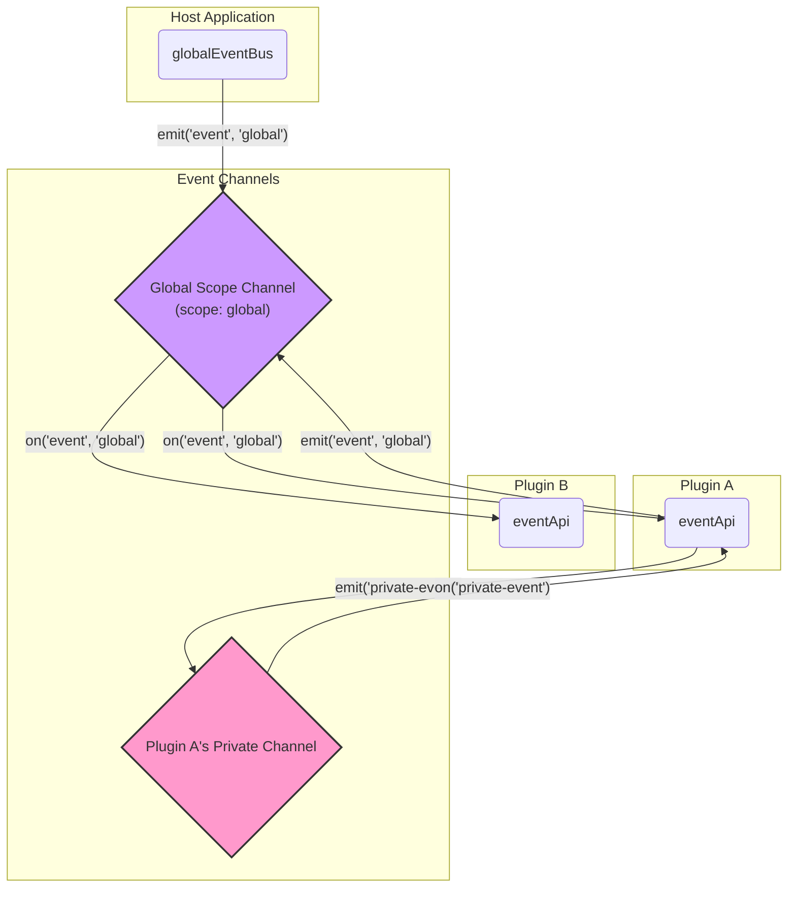

# 事件总线

事件总线（Event Bus）是系统内部的通信骨架，它采用发布-订阅（Publish-Subscribe）模式，允许应用内各个完全解耦的部分（主要是插件之间，以及插件与主应用之间）进行通信。

## 设计思想

- **解耦**: 事件的发布者和订阅者互相不知道对方的存在，它们只通过统一的“事件名称”进行关联。
- **全局单例**: 整个应用共享一个全局的事件总线实例 (`globalEventBus`)，确保信息可以在任何地方广播和接收。
- **类型安全**: 系统的核心事件都在 `@vue-plugin-arch/types` 包中的 `PluginEvents` 接口里有强类型定义，这为使用TypeScript的项目提供了很好的类型推断和编码安全。
- **作用域隔离**: 事件API支持 `scope` 参数。通过 `PluginEventApi` 代理，插件触发的事件默认会被限定在其自身的命名空间下，避免了全局事件的命名冲突。

## 作用域默认行为：EventBus vs EventApi

理解 `EventBus` 和 `EventApi` 在作用域（`scope`）处理上的默认行为差异，是正确使用事件系统的关键。最终的事件名由 `scope ? ${scope}:${event} : event` 的规则组合而成。

- **`globalEventBus` (供宿主应用使用)**
  - 这是全局唯一的事件总线实例。
  - 当宿主应用直接使用它并且**不提供 `scope` 参数**时，最终事件名就是事件本身（例如 `'my-event'`）。这是一种无作用域的、纯粹的全局事件。

- **`proxy.eventApi` (供插件使用)**
  - 这是 `PluginManager` 为每个插件单独创建的代理实例。
  - 当插件使用它并且**不提供 `scope` 参数**时，`scope` 会被**自动设置为插件自身的名称**（即 `package.json` 中的 `name` 字段）。因此，最终事件名是 `'my-plugin-name:my-event'`。
  - 这个机制使得插件的内部事件默认是**私有的**，避免了无意的全局污染和命名冲突。

### 如何实现通信？

基于以上规则，宿主和插件之间、或插件与插件之间的通信，必须**共同约定并显式使用一个 `scope`**。推荐使用 `'global'` 作为通用的作用域名称。

**正确示例：**

```typescript
// 宿主应用 (Host App) 发送一个全局事件
globalEventBus.emit('theme:changed', { theme: 'dark' }, 'global')

// 插件A (Plugin A) 发送一个供其他插件使用的全局事件
proxy.eventApi.emit('user:logout', { userId: '123' }, 'global')

// 插件B (Plugin B) 监听来自宿主或其他插件的全局事件
const onThemeChanged = payload => {
  console.log('Theme is now:', payload.theme)
}
const onUserLogout = payload => {
  console.log('User logged out:', payload.userId)
}

// 必须显式指定 'global' scope 才能监听到
proxy.eventApi.on('theme:changed', onThemeChanged, 'global')
proxy.eventApi.on('user:logout', onUserLogout, 'global')

// 在 teardown 中清理
return {
  teardown: async () => {
    proxy.eventApi.off('theme:changed', onThemeChanged, 'global')
    proxy.eventApi.off('user:logout', onUserLogout, 'global')
  },
}
```

### 通信模型图



## 核心API

事件总线基于 `mitt` 库实现，并由 `PluginEventApi` 代理提供给插件，其核心API如下：

- **`on(eventName, handler)`**: 订阅一个事件。每当该事件被触发时，注册的 `handler` 函数就会被调用。
- **`off(eventName, handler)`**: 取消订阅。为了防止内存泄漏，必须在不再需要监听时（通常在插件的 `teardown` 方法中）调用此方法，并传入与 `on` 方法相同的 `handler` 函数引用。
- **`emit(eventName, payload)`**: 发布一个事件。可以附带一个 `payload` 对象，将数据传递给所有订阅者。
- **`once(eventName, handler)`**: 订阅一个只触发一次的事件。处理器函数在执行一次后会自动被移除。

## 使用方法

插件通过注入的 `proxy.eventApi` 来使用事件总线。

### 示例：插件间通信

假设 `plugin-A` 在用户完成某个操作后，需要通知 `plugin-B`。

**Plugin A (发布者):**

```typescript
// In plugin-A's install method or component

function onUserLogin(user) {
  // 发布一个名为 'user:login' 的事件，并附带用户信息
  proxy.eventApi.emit('user:login', { id: user.id, name: user.name })
}
```

**Plugin B (订阅者):**

```typescript
// In plugin-B's install method

// 定义事件处理函数
const handleUserLogin = user => {
  console.log(`User ${user.name} has logged in. Welcome!`)
}

// 订阅 'user:login' 事件
proxy.eventApi.on('user:login', handleUserLogin)

// 必须在 teardown 中清理监听器！
return {
  teardown: async () => {
    proxy.eventApi.off('user:login', handleUserLogin)
  },
}
```

> **重要**: 忘记在 `teardown` 中调用 `off` 是导致内存泄漏的常见原因。请务必确保每个 `on` 都有对应的 `off`。

## 核心系统事件

除了插件自定义的事件，系统本身也会在关键生命周期点发布一系列核心事件。插件可以监听这些事件来响应系统状态的变化。所有核心事件都在 `PluginEvents` 类型中定义。

- **`plugin:loaded`**: 当一个插件成功加载并安装后触发。
  - `payload`: `{ name: string; manifest: PluginManifest }`

- **`plugin:unloaded`**: 当一个插件被卸载后触发。
  - `payload`: `{ name: string }`

- **`plugin:error`**: 当一个插件在加载或安装过程中出错时触发。
  - `payload`: `{ name:string; error: IPluginError }`

- **`panel:registered`**: 当一个新面板被注册到布局中时触发。
  - `payload`: `{ panelId: string; options: PanelOptions }`

- **`panel:removed`**: 当一个面板从布局中被移除时触发。
  - `payload`: `{ panelId: string }`

- **`data:changed`**: 当 `PluginDataService` 中的数据发生变化时触发。
  - `payload`: `{ scope: string; key: string; value: unknown; oldValue: unknown }`
