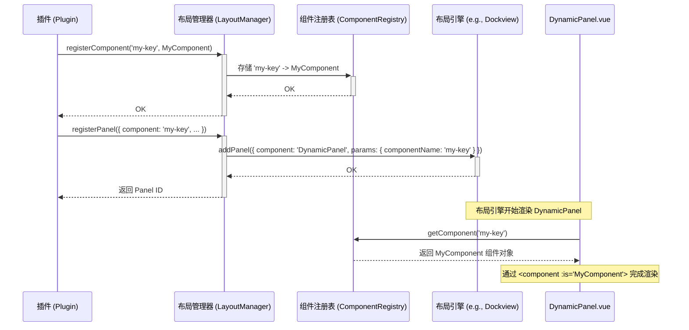

# 布局管理

布局管理系统是插件与用户界面交互的桥梁。它允许插件将自己的Vue组件动态地注册并渲染到主应用的布局中，而无需主应用在构建时知道这些组件的存在。该系统基于一个核心原则：**注册与渲染分离**。

## 核心概念

- **组件 (Component)**: 插件提供的标准Vue组件，包含了具体的UI和业务逻辑。
- **组件注册表 (Component Registry)**: 一个全局的、从字符串名称到Vue组件定义的映射表。插件不直接传递组件对象，而是先将组件注册到一个唯一的名称下。
- **面板 (Panel)**: 一个比组件更高阶的概念，是布局中的一个独立单元（例如一个可停靠的窗口或一个标签页）。每个面板都关联一个已注册的组件名称，并拥有自己的标题、ID和位置等属性。
- **动态面板 (`DynamicPanel.vue`)**: 一个特殊的“宿主”Vue组件。布局引擎（如Dockview）实际渲染的是这个组件，它再根据传入的组件名称，从组件注册表中查找并渲染真正的插件组件。

## 核心组件

### 1. `PluginLayoutManager`

这是布局系统的主要入口和管理器。它封装了底层UI布局库（本项目中为 `dockview-vue`）的复杂性，为插件提供了一套简洁、稳定的API。

**职责**:

- 提供 `registerComponent` 和 `unregisterComponent` 方法，用于管理`ComponentRegistry`。
- 提供 `registerPanel` 和 `removePanel` 方法，用于在布局中创建和销毁面板。
- 将对底层布局库的调用（如 `dockviewApi.addPanel`）进行封装。
- 在主Vue应用中注入 (`provide`) `ComponentRegistry` 的实例，供 `DynamicPanel.vue` 使用。

### 2. `ComponentRegistry`

一个专门用于存储“名称 -> 组件”映射的类。它将组件的标识（一个字符串）与其实现（Vue组件对象）解耦。

**职责**:

- 维护一个 `Map`，键是组件名称，值是组件的定义。
- 支持注册同步组件和异步组件（通过 `defineAsyncComponent`）。
- 提供 `getComponent(name)` 方法，供 `DynamicPanel.vue` 在渲染时查找组件。

#### 同步与异步注册的区别

`PluginLayoutManager` 提供了两种注册组件的方式：`registerComponent` 和 `registerAsyncComponent`，它们的核心区别在于**组件代码的加载时机**。

- **`registerComponent(name, component)` (同步)**
  - **用法**: 直接传递一个已经 `import` 的Vue组件对象。
  - **特点**: 组件对象会立刻被添加到注册表中。这意味着该组件的代码会包含在引用它的文件的代码块中，而不是被分割出去。
  - **适用场景**: 用于注册插件中非常核心、需要立即渲染的组件，或者与插件逻辑紧密耦合、无法分割的组件。

- **`registerAsyncComponent(name, loader)` (异步)**
  - **用法**: 传递一个返回 `Promise` 的加载器函数，通常是一个动态导入 `() => import('./MyComponent.vue')`。
  - **特点**: `ComponentRegistry` 内部会使用Vue的 `defineAsyncComponent` 方法创建一个异步组件包装器。组件的实际代码只有在它第一次被渲染时（即所在的 `DynamicPanel` 被挂载时）才会被网络请求加载。这能够有效地实现代码分割（Code Splitting）。
  - **适用场景**: **强烈推荐**。这是注册插件面板组件的首选方式，它可以显著减小主包体积，加快应用初始加载速度，实现真正的按需加载。

### 3. `DynamicPanel.vue`

这个通用包装器组件是实现动态渲染的关键。所有插件的UI最终都是在这个组件内部被渲染的。

#### 存在的必要性

`DynamicPanel.vue` 是一个关键的“代理”或“宿主”组件，它的存在是为了解决底层布局库 `dockview-vue` 的一个核心限制，是整个动态渲染模式的基石。

1.  **问题：`dockview-vue` 的静态限制**
    `dockview-vue` 的 `addPanel` API 要求 `component` 参数必须是一个**字符串**，且这个字符串对应的组件必须在主应用的Vue实例中被**全局注册**（例如通过 `app.component('ComponentName', ...)`）。

2.  **矛盾：插件的动态性**
    我们的插件是在**运行时**被动态加载的，插件内部的组件自然无法在主应用初始化时就进行全局注册。这导致我们不能直接将插件的组件名称（如 `'MyPluginComponent'`）传递给 `dockview-vue`。

3.  **解决方案：`DynamicPanel` 作为中间层**
    `DynamicPanel.vue` 就是为解决此问题而设计的。它的工作方式如下：
    - **唯一预注册组件**：在主应用启动时，我们将 `DynamicPanel` 作为**唯一**的面板组件进行全局注册，因此 `dockview-vue` 始终认识 `'DynamicPanel'` 这个名称。
    - **充当代理**：当 `LayoutManager` 需要添加一个插件面板时，它总是请求 `dockview-vue` 渲染 `'DynamicPanel'` 组件。
    - **动态派发**：同时，`LayoutManager` 将插件真正想要渲染的组件名称（例如 `'MyPluginComponent'`）通过 `params` 属性传递给 `DynamicPanel`。`DynamicPanel` 内部再通过 `<component :is="...">` 语法，从我们自己的 `ComponentRegistry` 中查找并渲染出真正的插件组件。

综上所述，`DynamicPanel.vue` 巧妙地绕过了底层库的限制，在静态注册的API和动态加载的插件之间建立了一座桥梁，从而实现了真正的动态面板功能。

**工作流程**:

1.  当 `LayoutManager` 创建一个新面板时，它告诉布局引擎渲染 `DynamicPanel` 组件。
2.  同时，它将插件想要渲染的真实组件的**名称**（例如 `'HelloWorldPanelComponent'`）以其他参数作为 `props` 传递给 `DynamicPanel`。
3.  `DynamicPanel` 组件通过 `inject` 获取 `ComponentRegistry` 实例。
4.  它使用 `props` 中传入的组件名称，在 `ComponentRegistry` 中查找对应的Vue组件。
5.  最后，它使用Vue的内置 `<component :is="resolvedComponent" />` 语法，将查找到的插件组件渲染出来。

## 工作流程：插件如何添加UI

以下是一个完整的流程，展示了插件如何将其UI呈现在屏幕上：

1.  **注册组件**: 在插件的 `install` 方法中，插件首先调用 `proxy.layoutApi.registerComponent`，将自己的Vue组件与一个唯一的字符串名称关联起来。

    ```typescript
    import MyComponent from './MyComponent.vue'
    const MY_COMPONENT_KEY = 'my-plugin-component'

    proxy.layoutApi.registerComponent(MY_COMPONENT_KEY, MyComponent)
    ```

2.  **注册面板**: 接着，插件调用 `proxy.layoutApi.registerPanel`，请求在布局的某个位置创建一个面板。它传递的不是组件实例，而是上一步注册的**组件名称**。

    ```typescript
    const panelId = proxy.layoutApi.registerPanel({
      id: 'my-unique-panel-id',
      component: MY_COMPONENT_KEY, // 传递组件名称
      title: 'My Awesome Panel',
      position: 'left', // 'left', 'right', 'center', etc.
    })
    ```

3.  **渲染过程**:
    - `LayoutManager` 接收到请求，并调用底层布局库（Dockview）的 `addPanel` 方法。
    - 它指定Dockview渲染 `DynamicPanel` 组件，并将 `{ componentName: MY_COMPONENT_KEY, ... }` 作为参数传给它。
    - `DynamicPanel` 启动，从 `ComponentRegistry` 中查找到 `MY_COMPONENT_KEY` 对应的 `MyComponent`，并将其渲染出来。

4.  **资源清理**: 当插件被卸载时，其 `teardown` 方法必须被调用。在这个方法中，插件需要负责任地调用 `removePanel(panelId)` 和 `unregisterComponent(MY_COMPONENT_KEY)` 来清理它所创建的UI资源，防止内存泄漏。

### 渲染流程序列图


