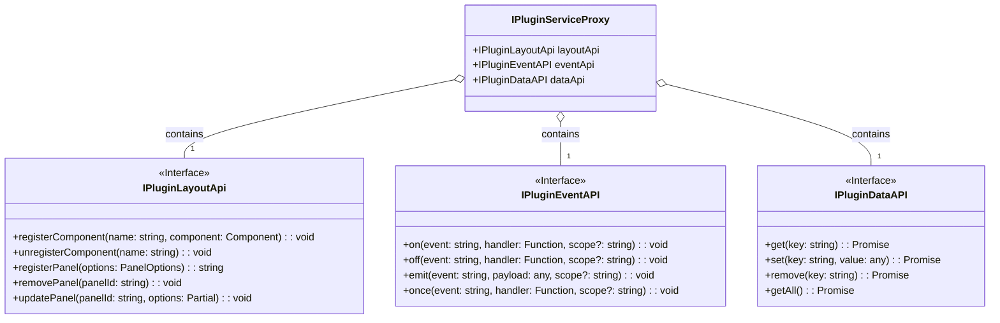

# 插件API参考

本文档详细描述了提供给每个插件的 `IPluginServiceProxy` 对象，它是插件与主应用系统交互的唯一接口。这个代理对象作为唯一的参数被传递到插件的 `install` 方法中。

```typescript
import type { IPluginServiceProxy, PluginAPI } from '@vue-plugin-arch/types'

export const install = (proxy: IPluginServiceProxy): PluginAPI => {
  // 使用 proxy 的API与系统交互
  // proxy.layoutApi.registerPanel(...);
  // proxy.eventApi.emit(...);
  // proxy.dataApi.set(...);

  return {
    teardown: async () => {
      /* ... */
    },
  }
}
```

`proxy` 对象的结构和其包含的核心API方法如下面的类图所示。关于每个方法更详细的参数类型和说明，请参考 `@vue-plugin-arch/types` 包中的类型定义。

## API 结构类图


