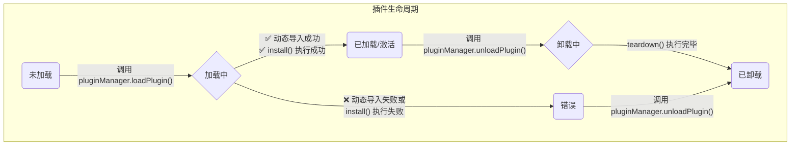

# 插件体系

插件体系是本架构的基石，它负责管理插件从发现、加载到运行和卸载的整个生命周期。这个体系的设计确保了主应用和插件之间的松耦合，使得功能可以被动态、安全地管理。

## 核心组件

插件体系主要由两大核心组件构成：

### 1. `PluginManager` (插件管理器)

`PluginManager` 是插件管理的最高协调者。它的主要职责是：

- **URL-based加载**: 接收包含URL的插件清单，通过 `import(pluginUrl)` 动态加载插件代码，支持本地 `/@fs/` URL和远程HTTP URL。
- **按需加载插件**: 提供 `loadPlugin(manifest)` 方法，根据插件清单异步加载插件代码。利用ES模块的动态 `import()` 特性和importMap机制实现模块解析。
- **管理生命周期**: 协调插件的安装 (`install`) 和卸载 (`teardown`) 流程。
- **注入API代理**: 在安装插件时，创建一个 `PluginServiceProxy` 实例，并将这个安全的API代理注入到插件中，供插件调用核心服务。
- **错误处理**: 捕获插件在加载或安装过程中发生的错误，更新插件状态，并发出全局错误事件。

### 2. `PluginStateManager` (插件状态管理器)

如果说 `PluginManager` 是指挥官，那么 `PluginStateManager` 就是情报官。它精确地跟踪和管理每个插件的内部状态。

- **状态机**: 为每个插件维护一个状态对象 (`PluginState`)，记录其当前的生命周期阶段。
- **资源记录**: 跟踪由插件注册的各种资源，例如它创建的面板ID (`panels`) 和注册的事件监听器 (`eventHandlers`)，为后续的资源清理做准备。
- **状态查询**: 提供一系列工具方法（如 `isLoaded`, `hasError`）来查询插件的当前状态。

## 插件生命周期与状态



一个插件在其生命周期中会经历以下几种核心状态，这些状态由 `PluginStateManager` 进行管理：

1.  **`discovered` (已发现)**
    - **时机**: 构建时。
    - **描述**: Vite插件扫描文件系统，发现了插件的 `package.json`，并将其信息写入到插件清单中。这只是一个构建时的概念。

2.  **`loading` (加载中)**
    - **时机**: `PluginManager.loadPlugin()` 被调用时。
    - **描述**: `PluginManager` 开始执行插件的异步加载函数 `loader()`。此时，插件的初始状态被创建，状态标记为 `loading`。

3.  **`loaded` (已加载/已激活)**
    - **时机**: 插件代码加载成功，并且其 `install` 方法成功执行完毕后。
    - **描述**: 插件已成功集成到系统中，其注册的组件和面板可见，监听的事件已生效。这是插件的正常工作状态。

4.  **`error` (错误)**
    - **时机**: 在 `loading` 或 `install` 过程中发生任何异常。
    - **描述**: 插件加载失败，无法正常工作。错误信息会被记录在插件的状态对象中，并触发 `plugin:error` 事件。

5.  **`unloaded` (已卸载)**
    - **时机**: `PluginManager.unloadPlugin()` 执行完毕后。
    - **描述**: 插件的状态被从 `PluginStateManager` 中移除。如果插件API返回了 `teardown` 方法，该方法会被执行，用于清理插件注册的组件、面板、事件监听器等资源。

## 插件的定义

为了能被系统正确识别和加载，每个插件包必须遵循特定的格式。

- **入口文件**: 插件的 `package.json` 中 `main` 或 `module` 字段指向的入口文件。
- **导出规范**: 入口文件必须导出一个名为 `install` 的函数。此函数是插件的安装入口。

一个典型的插件 `install` 函数如下所示：

```typescript
// packages/plugins/plugin-helloworld/src/index.ts

import type { IPluginServiceProxy, PluginAPI } from '@vue-plugin-arch/types'
import HelloWorldPanel from './components/HelloWorldPanel.vue'

// 插件的安装方法
export const install = (proxy: IPluginServiceProxy): PluginAPI => {
  // 1. 使用API代理注册组件、面板等
  proxy.layoutApi.registerComponent('MyComponent', HelloWorldPanel)
  const panelId = proxy.layoutApi.registerPanel({
    id: 'my-panel',
    component: 'MyComponent',
    title: 'My Panel',
  })

  // 2. 返回一个包含 teardown 方法的API对象
  return {
    teardown: async () => {
      // 在此清理资源
      proxy.layoutApi.removePanel(panelId)
      proxy.layoutApi.unregisterComponent('MyComponent')
    },
  }
}
```

### `install` 函数

- **参数**:接收一个 `proxy: IPluginServiceProxy` 对象，这是插件与系统核心功能交互的唯一途径。
- **返回值**: 必须返回一个 `PluginAPI` 对象。该对象可以包含一个可选的 `teardown` 异步函数。`PluginManager` 会在卸载插件时调用 `teardown`，让插件有机会清理自己创建的资源，防止内存泄漏。
