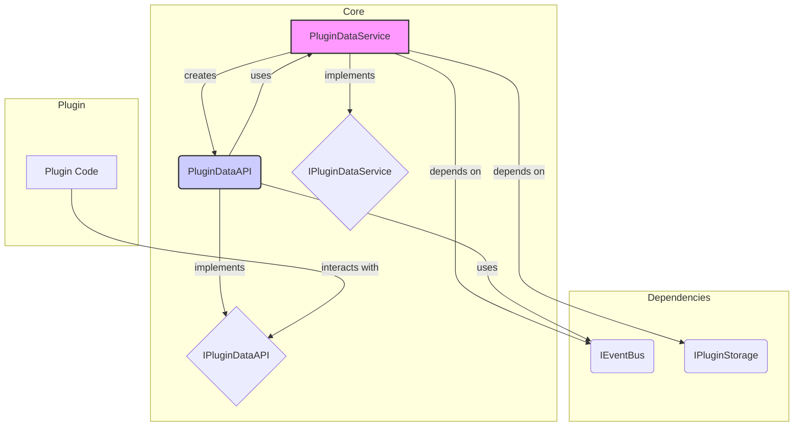
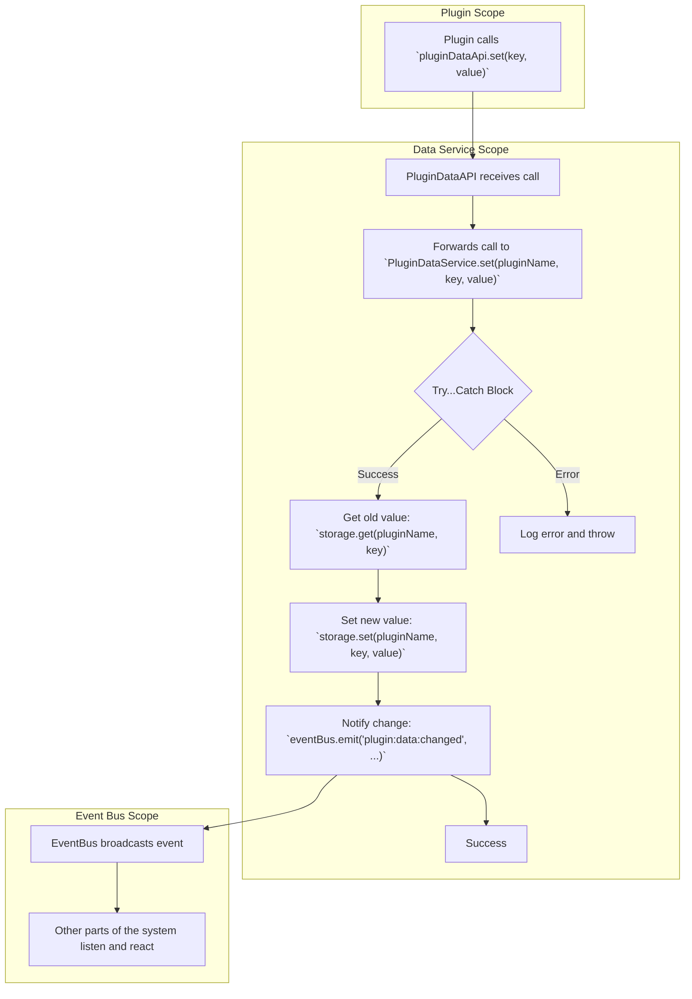

# PluginDataService 模块分析

本文档分析了 `@layout-plugin-loader/core` 包中的 `PluginDataService` 模块。

## 模块图 (Mermaid)

下图描述了 `PluginDataService` 的核心构成和依赖关系。

**模块说明:**

- **`PluginDataService`**: 核心服务，负责管理所有插件的数据。它依赖 `IEventBus` 来发送数据变更通知，依赖 `IPluginStorage` 来持久化插件数据。
- **`PluginDataAPI`**: 为每个插件创建的独立 API 实例。它作为 `PluginDataService` 的代理，使插件只能访问自身的数据，确保了数据的隔离性。
- **`IEventBus`**: 事件总线，用于在系统不同部分之间解耦通信。在这里，它主要用于广播数据变更事件。
- **`IPluginStorage`**: 存储接口，定义了插件数据的存取方法。具体的实现（如 `MemoryPluginStorage`）可以被注入到 `PluginDataService` 中。
- **`Plugin Code`**: 插件的业务代码，通过 `PluginDataAPI` 与数据服务进行交互。

---

## 流程图 (Mermaid)

下图展示了插件通过 `PluginDataAPI` 设置数据并触发通知的核心流程。

**流程说明:**

1.  **插件调用**: 插件代码调用其专属的 `pluginDataApi.set()` 方法来存储或更新数据。
2.  **API 转发**: `PluginDataAPI` 实例接收到调用，并将请求转发给核心的 `PluginDataService`，同时附加上插件自身的名称 (`pluginName`) 以作区分。
3.  **数据处理**:
    - `PluginDataService` 在一个 `try...catch` 块中执行操作以确保健壮性。
    - 它首先从 `storage` 中获取旧值，以便后续通知时可以提供。
    - 然后，它调用 `storage.set()` 将新值持久化。
    - 如果操作成功，它会调用 `notifyChange()` 方法。
4.  **发布事件**: `notifyChange()` 方法通过 `eventBus` 发布一个 `plugin:data:changed` 事件，并将插件名称、键、旧值和新值作为负载。
5.  **事件广播**: `EventBus` 将此事件广播给所有订阅了该事件的监听器，从而实现对数据变更的响应。
6.  **错误处理**: 如果在存储过程中发生任何错误，`catch` 块会捕获异常，记录错误信息，然后将异常向上抛出。
